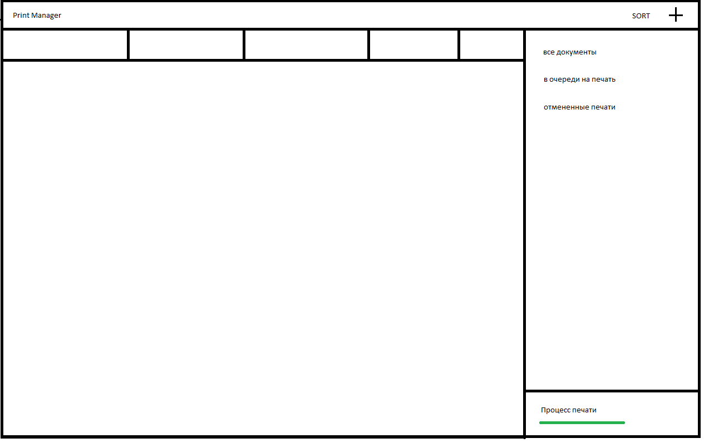

# wpf_print_manager

## Задание

Напишите программу, эмулирующую работу диспетчера печати
документов, используя несколько потоков.
1. Диспетчер печати может работать с несколькими типами документов
(3-5 типов).
2. Каждый тип документа должен иметь уникальные реквизиты:
продолжительность печати, наименование типа документа, размер бумаги.
3. Диспетчер помещает в очередь печати неограниченное количество
документов. При этом каждый документ может быть обработан, только если в
это же время не обрабатывается другой документ, время обработки каждого
документа равно продолжительности печати данного документа. 
4. Диспетчер должен иметь следующие методы:
    * Принять документ на печать. Метод не должен блокировать
    выполнение программы.
    * Отменить печать принятого документа, если он еще не был
    напечатан.
    * Получить отсортированный список напечатанных документов по порядку печати.
    документов, по продолжительности печати, по размеру бумаги.

## Набросок интерфейса 

## Готовый интерфейс

